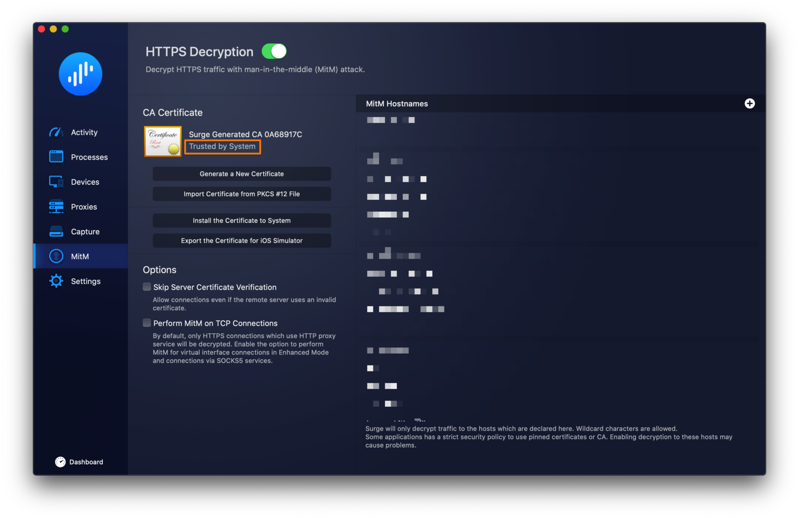

<p align="center">
  <a href="https://github.com/geekdada/yasd">
    
  </a>
</p>

# yasd-helper

[![NPM version][npm-image]][npm-url]
[![TAONPM version][taonpm-image]][taonpm-url]
![Nodejs][nodejs-version]
[![David deps][david-image]][david-url]
[![Known Vulnerabilities][snyk-image]][snyk-url]
[![npm download][download-image]][download-url]
[](https://packagephobia.now.sh/result?p=yasd-helper)

[npm-image]: https://img.shields.io/npm/v/yasd-helper.svg?style=flat-square
[npm-url]: https://npmjs.org/package/yasd-helper
[david-image]: https://img.shields.io/david/geekdada/yasd-helper.svg?style=flat-square
[david-url]: https://david-dm.org/geekdada/yasd-helper
[snyk-image]: https://snyk.io/test/npm/yasd-helper/badge.svg?style=flat-square
[snyk-url]: https://snyk.io/test/npm/yasd-helper
[download-image]: https://img.shields.io/npm/dm/yasd-helper.svg?style=flat-square
[download-url]: https://npmjs.org/package/yasd-helper
[taonpm-image]: https://npm.taobao.org/badge/v/yasd-helper.svg
[taonpm-url]: https://npm.taobao.org/package/yasd-helper
[nodejs-version]: https://img.shields.io/node/v/yasd-helper

[中文](/README_zh-CN.md) | [English](/README.md)

Surge only provides HTTP API to its users at the moment, crippling the possibility of using the PWA version of YASD. yasd-helper's goal is to expose HTTPS endpoints to Surge.

## Installation

Before installing yasd-helper, you need to make sure your environment already has Node.js installed (>=12.0.0).

```bash
$ npm install yasd-helper -g
```

## Usage

yasd-helper uses the existing CA certificate generated by Surge to issue new certificates, so please make sure your Surge config has a valid MITM certificate, and your operating system has trusted the certificate. As long as the CA certificate is trusted by the operating system, you won't be prompted to trust any new certificates issued by it.



```bash
$ yasd-helper start --surge /path/to/surge.conf --host 192.168.1.2.nip.io [--port 8443]
```

1. [nip.io](nip.io) gives you a domain based on the IP address. `192.168.1.2.nip.io` will be resolved to `192.168.1.2` where yasd-helper is going to be running at.
2. yasd-helper only exposes HTTPS endpoints at `https://192.168.1.2.nip.io`.
3. You can make it accessible outside your intranet, just to use the DDNS domain as `host`. yasd-helper will make sure only the responses from Surge API get passed.
4. You can use only one yasd-helper to access as many Surge instances as possible, as long as they are on the same intranet.
5. The default port is 8443, you can define another one by adding `--port <number>`

## Daemonize

### macOS LaunchAgent

TBD

### PM2

TBD
